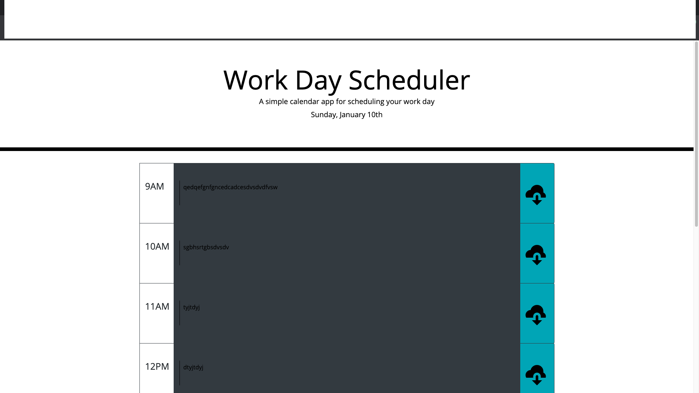
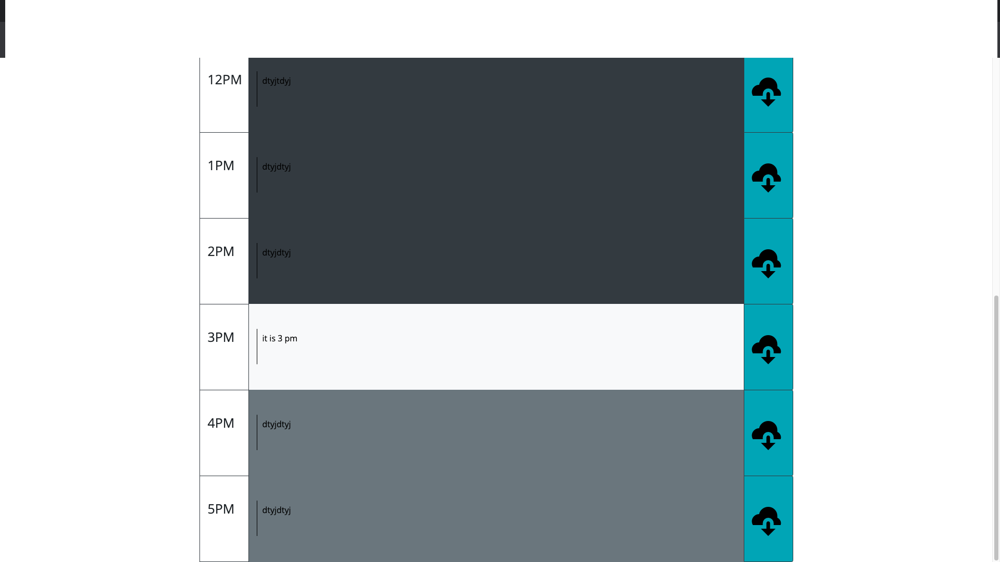

# work-scheduler
work sceduler is an interactive program that allows the user to plan their day.
the program allows the user to insert and store their hourly tasks during business hours(9AM - 5PM).
the program is also color coordinates each time slot. it will make the box dark grey if the take slot has already passed, white if it is the current hour of the day, and finally light grey if the time slot is in the future.

[link]https://samuel408.github.io/work-scheduler/
